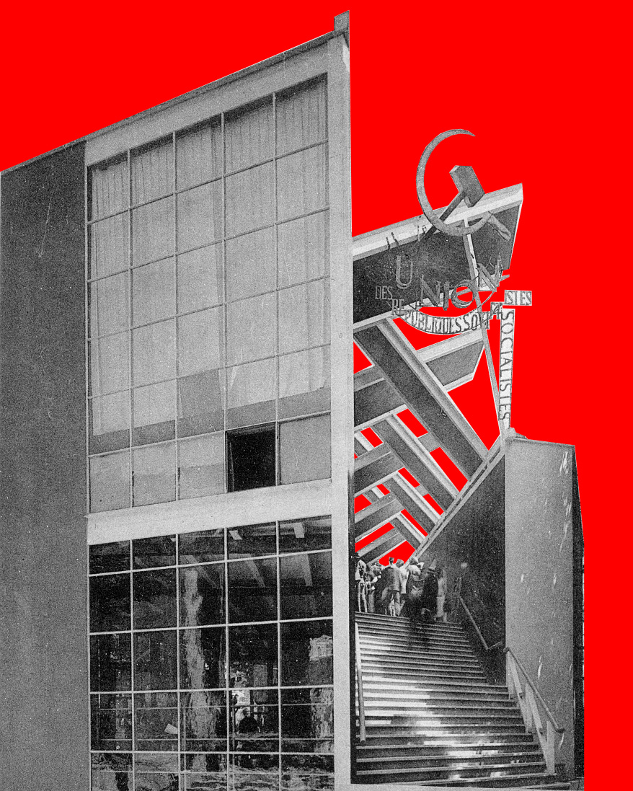
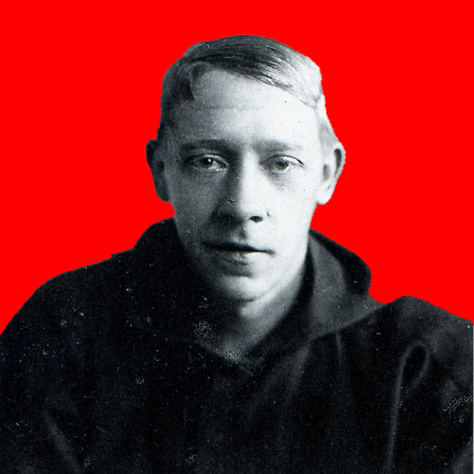
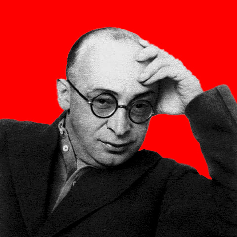
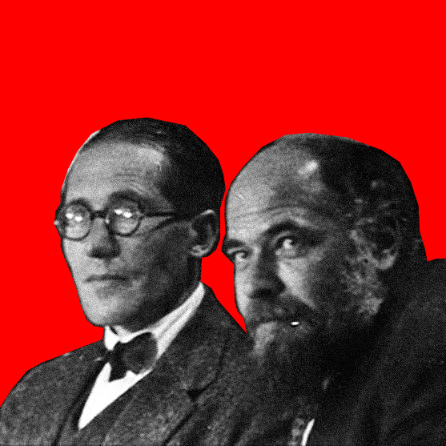
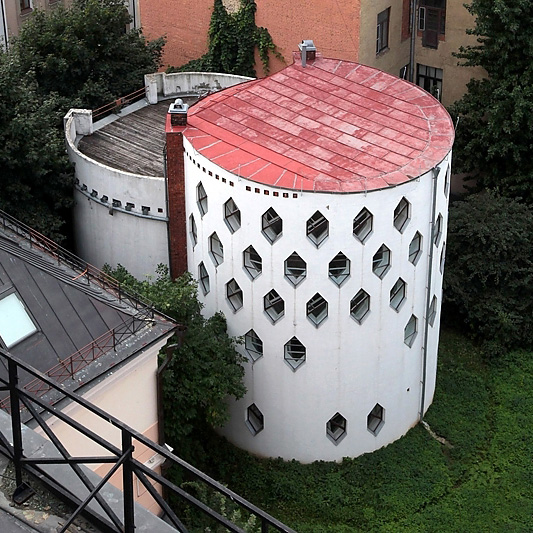
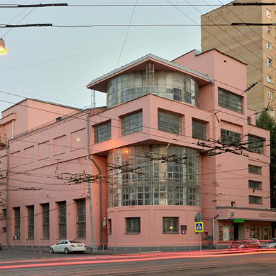
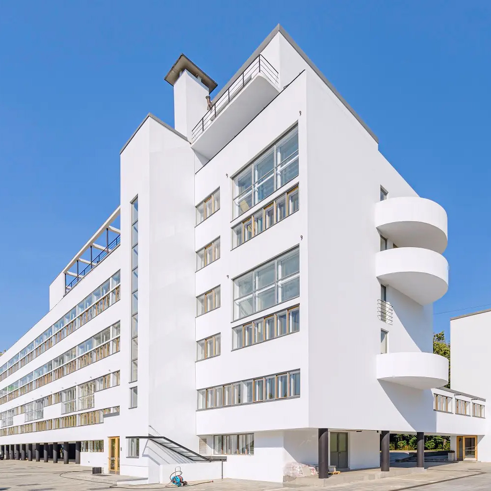
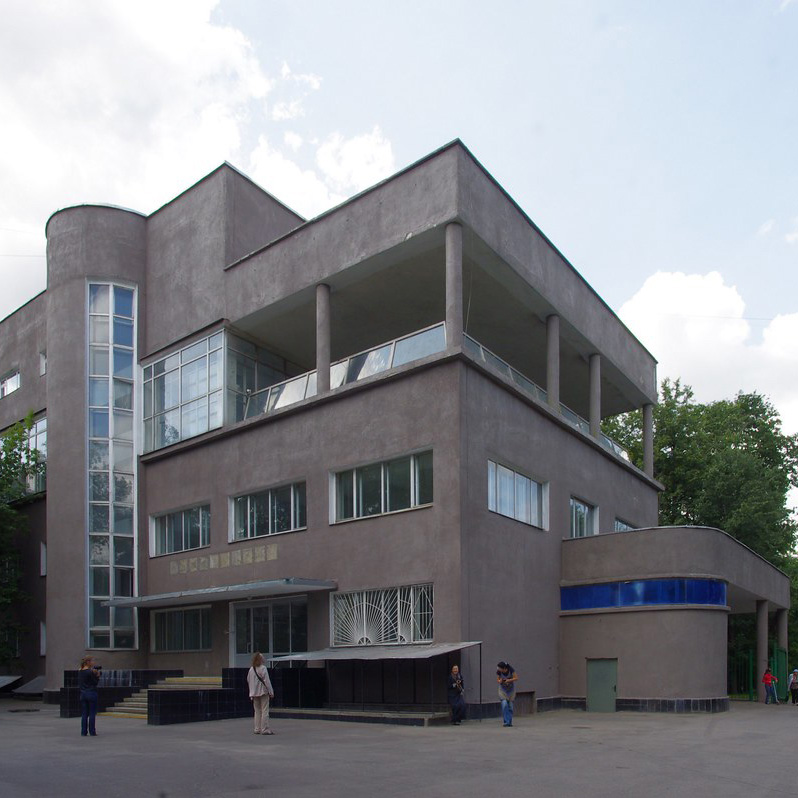
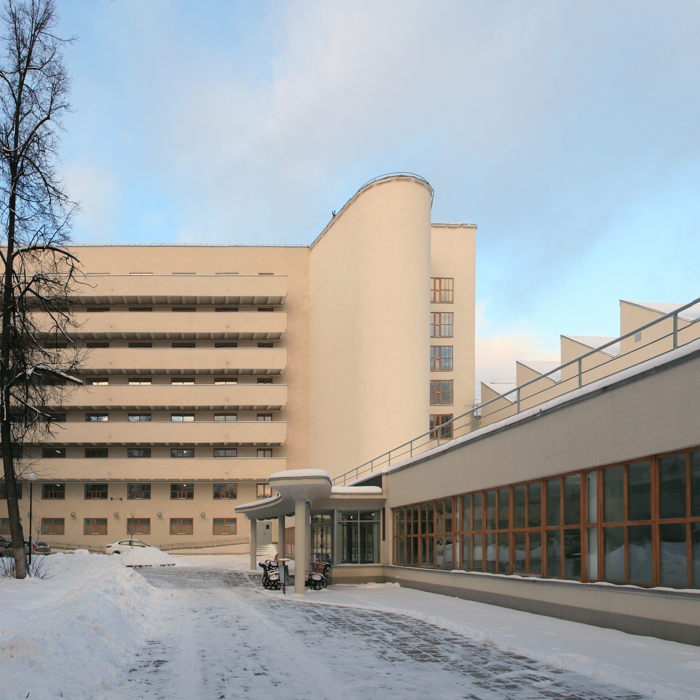
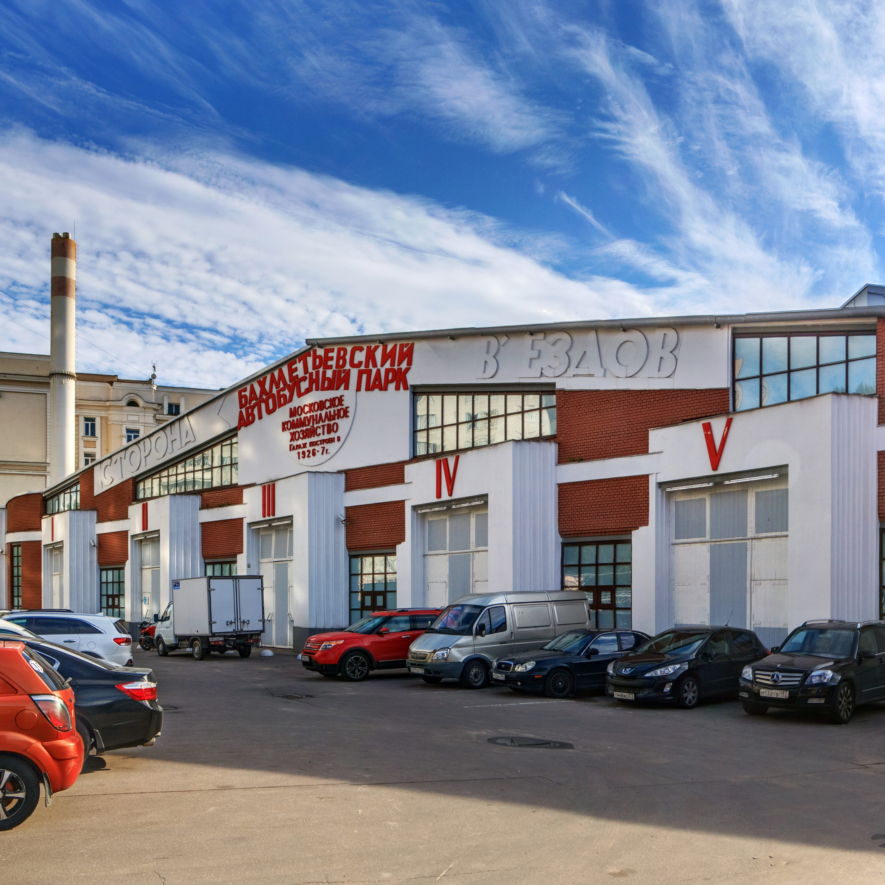

[about.html](https://github.com/user-attachments/files/24905249/about.html)
<!DOCTYPE html>
<html lang="pl">
<head>
    <meta charset="UTF-8">
    <meta name="viewport" content="width=device-width, initial-scale=1.0">
    <title>Konstruktywizm – o stylu</title>
    <link rel="stylesheet" href="style.css">
    <link rel="preconnect" href="https://fonts.googleapis.com">
    <link rel="preconnect" href="https://fonts.gstatic.com" crossorigin>
    <link href="https://fonts.googleapis.com/css2?family=Montserrat:wght@300;500;700&display=swap" rel="stylesheet">
</head>
<body>

<header>
    <nav class="menu">[gallery.html](https://github.com/user-attachments/files/24905252/gallery.html)
[architects.html](https://github.com/user-attachments/files/24905251/architects.html)

    <a href="index.html">Strona główna</a>
    <a href="about.html">O stylu</a>
    <a href="architects.html">Architekci</a>
    <a href="gallery.html">Budynki</a>
</nav>
</header>

<main class="content">

    <h1>Konstruktywizm</h1>

    

    

        Konstruktywizm to awangardowy nurt architektoniczny, 
        który rozwinął się w Rosji w latach 20. XX wieku. 
        Jego głównym celem było tworzenie budynków funkcjonalnych, 
        które odpowiadały na potrzeby społeczne oraz realizowały 
        założenia ideologii socjalistycznej. Architektura konstruktywistyczna 
        miała być narzędziem do budowy nowego społeczeństwa.
    

    

        Charakterystyczne dla tego stylu są proste, geometryczne bryły, 
        całkowity brak ornamentów oraz eksponowanie konstrukcji budynków. 
        W projektach wykorzystywano nowoczesne materiały, takie jak stal, 
        szkło i beton, które pozwalały tworzyć innowacyjne i praktyczne 
        rozwiązania architektoniczne. Konstruktywizm łączył funkcję z formą, 
        stawiając nacisk na użyteczność i dostępność dla szerokich warstw społeczeństwa.
    

    

      Architektura konstruktywizmu często pełniła także funkcję społeczną 
      i edukacyjną, promując ideały kolektywizmu i współpracy. Budynki 
      takie jak domy robotnicze, kluby czy szkoły miały integrować mieszkańców 
      i wspierać nowe, socjalistyczne wartości. Dzięki temu konstruktywizm stał 
      się nie tylko stylem architektonicznym, ale także manifestem nowoczesnej 
      ideologii i wizji przyszłości.
    

    

        Więcej informacji można znaleźć na stronie
        <a href="https://pl.wikipedia.org/wiki/Konstruktywizm"
           target="_blank" rel="noopener">
           Wikipedia – Konstruktywizm
        </a>.
    

</main>

<footer>
    

        Projekt edukacyjny z przedmiotu „Tworzenie stron www” 
        Strona stworzona przez Denisa Mokrushina

    

</footer>

</body>
</html>
<!DOCTYPE html>
<html lang="pl">
<head>
    <meta charset="UTF-8">
    <meta name="viewport" content="width=device-width, initial-scale=1.0">
    <title>Architekci konstruktywizmu</title>
    <link rel="stylesheet" href="style.css">
    <link rel="preconnect" href="https://fonts.googleapis.com">
    <link rel="preconnect" href="https://fonts.gstatic.com" crossorigin>
    <link href="https://fonts.googleapis.com/css2?family=Montserrat:wght@300;500;700&display=swap" rel="stylesheet">
</head>
<body>

<header class="page-header">
    <nav class="menu">
    <a href="index.html">Strona główna</a>
    <a href="about.html">O stylu</a>
    <a href="architects.html">Architekci</a>
    <a href="gallery.html">Budynki</a>
</nav>
</header>

<main class="architects-container">
    
    <h1>Kluczowi architekci konstruktywizmu</h1>

    

        

    

        
        <h2>Władimir Tatlin</h2>
        
Twórca projektu Pomnika III Międzynarodówki.

    

    

        

            Rosyjski artysta i architekt awangardowy (1885–1953),
            jeden z najważniejszych przedstawicieli konstruktywizmu. 
            Jego najsłynniejszym dziełem jest projekt „Wieży Tatlina” – 
            futurystycznej wieży symbolizującej nową erę sztuki i technologii 
            po rewolucji październikowej. Tatlin łączył sztukę z funkcjonalnością, 
            dążąc do stworzenia praktycznych form architektonicznych i rzeźbiarskich.
        

        

        Więcej informacji można znaleźć na stronie
        <a href="https://pl.wikipedia.org/wiki/Władimir_Tatlin"
           target="_blank" rel="noopener">
           Wikipedia – Władimir Tatlin
        </a>
        

    

       

    

            
            <h2>Konstantin Melnikow</h2>
            
 Autor eksperymentalnych domów mieszkalnych w Moskwie.

        

         

        

            Rosyjski architekt i awangardowy projektant (1890–1974), 
            jeden z pionierów nowoczesnej architektury w Związku Radzieckim. 
            Znany z unikalnego stylu łączącego funkcjonalizm z ekspresyjną formą. 
            Jego najsłynniejszym dziełem jest Pawilon Melnikowa w Moskwie oraz
            Klub Robotniczy w Chimkach. Melnikow eksperymentował z geometrycznymi 
            kształtami i światłem, tworząc oryginalne i nowatorskie projekty.
        

         

        Więcej informacji można znaleźć na stronie
        <a href="https://pl.wikipedia.org/wiki/Konstantin_Mielnikow"
           target="_blank" rel="noopener">
           Wikipedia – Konstantin Melnikow
        </a>
        

    

        

    

            
            <h2>Moisei Ginzburg</h2>
            

                Teoretyk konstruktywizmu, autor budynku Narkomfin.
            

      

       

        

            Radziecki architekt i teoretyk architektury (1892–1946), 
            jeden z czołowych przedstawicieli konstruktywizmu. 
            Był liderem grupy ASNOVA, która promowała nowoczesne i 
            funkcjonalne podejście do architektury. Jego najsłynniejszym 
            projektem jest budynek „Domu Pracy” w Moskwie, który łączył 
            funkcje mieszkalne z elementami społecznymi i technologicznymi. 
            Ginzburg miał duży wpływ na rozwój radzieckiej architektury awangardowej.
        

         

        Więcej informacji można znaleźć na stronie
        <a href="https://ru.wikipedia.org/wiki/Гинзбург,_Моисей_Яковлевич"
           target="_blank" rel="noopener">
           Wikipedia – Moisei Ginzburg
        </a>
        

    

       

    

            
            <h2>Bracia Wiesnin</h2>
            

                Twórcy nowatorskich projektów przemysłowych
                i urbanistycznych.
            

         

       

        

            Wiaczesław (1889–1954), Aleksiej (1888–1959) i Leonid Wiesninowie byli 
            radzieckimi architektami awangardowymi i przedstawicielami konstruktywizmu.
             Wspólnie tworzyli innowacyjne projekty, które łączyły funkcjonalność z 
             nowoczesnym designem. Ich prace skupiały się na budynkach użyteczności 
             publicznej oraz mieszkalnych, kładąc nacisk na prostotę formy i praktyczność. 
             Bracia Wiesnin mieli duży wpływ na rozwój architektury radzieckiej w latach 20. 
             i 30. XX wieku.
        

          

        Więcej informacji można znaleźć na stronie
        <a href="https://ru.wikipedia.org/wiki/Братья_Веснины"
           target="_blank" rel="noopener">
           Wikipedia – Bracia Wiesnin
        </a>
        

    

    

</main>

<footer>
    

        Projekt edukacyjny z przedmiotu „Tworzenie stron www” 
        Strona stworzona przez Denisa Mokrushina

    

</footer>

</body>
</html>
<!DOCTYPE html>
<html lang="pl">
<head>
    <meta charset="UTF-8" />
    <meta name="viewport" content="width=device-width, initial-scale=1" />
    <title>Galeria – Konstruktywizm</title>
    <link rel="stylesheet" href="style.css" />
    <link rel="preconnect" href="https://fonts.googleapis.com" />
    <link rel="preconnect" href="https://fonts.gstatic.com" crossorigin />
    <link href="https://fonts.googleapis.com/css2?family=Montserrat:wght@300;500;700&display=swap" rel="stylesheet" />
</head>
<body>
<header>
    <nav class="menu">
        <a href="index.html">Strona główna</a>
        <a href="about.html">O stylu</a>
        <a href="architects.html">Architekci</a>
        <a href="gallery.html">Budynki</a>
    </nav>
</header>

<main class="gallery-container">
    <h1>Kluczowe budynki konstruktywizmu</h1>
    

        

            

                
                <figcaption>Dom Melnikova, Moskwa</figcaption>
            

            

                

                    <button class="close-btn" aria-label="Close card">&times;</button>

                    

                        <h2>Dom Melnikova</h2>
                        

                            Dom Melnikova to eksperymentalny budynek mieszkalny w Charkowie, 
                            zaprojektowany przez słynnego architekta Konstantego Melnikowa w 
                            latach 1927–1929. Jest jednym z najważniejszych przykładów radzieckiego 
                            konstruktywizmu. Budynek wyróżnia się unikalną formą, dużą ilością świetlików 
                            i otwartymi przestrzeniami wspólnymi, które miały sprzyjać kolektywnemu stylowi 
                            życia. Dom Melnikova jest symbolem awangardowej architektury XX wieku.
                        

                         

                            Więcej informacji można znaleźć na stronie
                            <a href="https://pl.wikipedia.org/wiki/Dom_Mielnikowa"
                            target="_blank" rel="noopener">
                            Wikipedia – Dom Melnikova
                        </a>
                    

                        
                    

                    

                        
                    

                

            

        

        

            

                
                <figcaption>Klub Zujeva</figcaption>
            

            

                

                    <button class="close-btn" aria-label="Close card">&times;</button>

                    

                        <h2>Klub Zujeva</h2>
                        

                            Klub Zujeva to przykład awangardowej architektury radzieckiej z lat 1920-1930. 
                            Zaprojektowany przez Władimira Zujeva, był miejscem spotkań i działalności kulturalnej 
                            dla robotników i mieszkańców miasta. Budynek wyróżnia się prostą, funkcjonalną formą i 
                            nowoczesnym stylem konstruktywistycznym, łącząc przestrzenie rekreacyjne, edukacyjne i społeczne.
                        

                        

                            Więcej informacji można znaleźć na stronie
                            <a href="https://ru.wikipedia.org/wiki/Дом_культуры_имени_Зуева"
                            target="_blank" rel="noopener">
                            Wikipedia – Klub Zujeva
                        </a>
                    

                    

                    

                        
                    

                

            

        

        

            

                
                <figcaption>Dom Narkomfin</figcaption>
            

            

                

                    <button class="close-btn" aria-label="Close card">&times;</button>

                    

                        <h2>Dom Narkomfin</h2>
                        

                            Dom Narkomfin to słynny budynek mieszkalny w Moskwie, 
                            zbudowany w latach 1928-1930. Zaprojektowany przez architektów 
                            Moiseja Ginzburga i Ignatija Milina, jest przykładem konstruktywizmu 
                            i awangardowej architektury radzieckiej. Budynek był eksperymentem socjalnym,
                            łączącym funkcje mieszkalne z przestrzeniami wspólnymi, takimi jak kuchnie i 
                            pralnie, aby promować kolektywny styl życia. Dom Narkomfin miał duży wpływ na 
                            rozwój modernizmu i projektowania mieszkań na całym świecie. 
                        

                            

                                Więcej informacji można znaleźć na stronie
                                <a href="https://ru.wikipedia.org/wiki/Дом_Наркомфина"
                                target="_blank" rel="noopener">
                                Wikipedia – Dom Narkomfin
                            </a>
                        

                    

                    

                        
                    

                

            

        

        

            

                
                <figcaption>Pałac Kultury ZIL</figcaption>
            

            

                

                    <button class="close-btn" aria-label="Close card">&times;</button>

                    

                        <h2>Pałac Kultury ZIL</h2>
                        

                            Pałac Kultury ZIL (Pałac Kultury im. I. Lichaczowa) to jeden z 
                            najważniejszych przykładów radzieckiego konstruktywizmu w Moskwie. 
                            Został zaprojektowany przez braci Wiesninów i zbudowany w latach 
                            1931–1937 dla pracowników zakładów ZIL. Budynek pełnił funkcję 
                            centrum kulturalnego i edukacyjnego, oferując sale koncertowe, 
                            teatry, kluby i przestrzenie rekreacyjne. Pałac Kultury ZIL jest 
                            symbolem idei architektury jako narzędzia kształtowania nowego, 
                            społecznego stylu życia.
                        

                         

                                Więcej informacji można znaleźć na stronie
                                <a href="https://ru.wikipedia.org/wiki/Дворец_культуры_ЗИЛа"
                                target="_blank" rel="noopener">
                                Wikipedia – Pałac Kultury ZIL
                            </a>
                        

                    

                    

                        
                    

                

            

        

        

            

                
                <figcaption>Dom-komuna</figcaption>
            

            

                

                    <button class="close-btn" aria-label="Close card">&times;</button>

                    

                        <h2>Dom-komuna</h2>
                        

                            Dom-komuna to typ eksperymentalnego budynku mieszkalnego 
                            powstałego w Związku Radzieckim w latach 20. i 30. XX wieku. 
                            Był związany z ideami konstruktywizmu i miał na celu kształtowanie 
                            nowego, kolektywnego stylu życia. Prywatne przestrzenie mieszkalne 
                            były ograniczone, natomiast duży nacisk kładziono na funkcje wspólne, 
                            takie jak kuchnie, jadalnie, pralnie czy świetlice. Dom-komuna stanowił 
                            architektoniczne odzwierciedlenie utopijnych idei społecznych epoki.
                        

                        

                                Więcej informacji można znaleźć na stronie
                                <a href="https://ru.wikipedia.org/wiki/Дом-коммуна"
                                target="_blank" rel="noopener">
                                Wikipedia – Dom-komuna
                            </a>
                        

                    

                    

                        
                    

                

            

        

        

            

                
                <figcaption>Garaż Bakhmetievsky</figcaption>
            

            

                

                    <button class="close-btn" aria-label="Close card">&times;</button>

                    

                        <h2>Garaż Bakhmetievsky</h2>
                        

                            Garaż Bakhmetievsky to awangardowy budynek z lat 1926–1927 w Moskwie, 
                            zaprojektowany przez Władimira Krinsky’ego i Konstantina Melnikowa. 
                            Jest przykładem konstruktywizmu i nowoczesnej architektury przemysłowej. 
                            Garaż powstał jako przestrzeń do parkowania i naprawy samochodów, 
                            łącząc funkcjonalność z innowacyjnym designem. Budynek charakteryzuje 
                            się dynamiczną formą i geometrycznymi kształtami, które były nowatorskie 
                            w tamtym czasie.
                        

                        

                                Więcej informacji można znaleźć na stronie
                                <a href="https://ru.wikipedia.org/wiki/Бахметьевский_гараж"
                                target="_blank" rel="noopener">
                                Wikipedia – Garaż Bakhmetievsky
                            </a>
                        

                    

                    

                        
                    

                

            

        

    

</main>

<footer>
    

        Projekt edukacyjny z przedmiotu „Tworzenie stron www” 
        Strona stworzona przez Denisa Mokrushina
    

</footer>

<!-- Wiem, że nie uczyliśmy się jeszcze skryptów, ale chciałem stworzyć wyskakujące okienko,
które można zamknąć klikając krzyżyk, więc użyłem JavaScriptu.
Ten skrypt obsługuje zamykanie takiego okienka po kliknięciu na przycisk z klasą 'close-btn'.
Po kliknięciu:
1. zatrzymuje propagację zdarzenia, aby klik nie wpływał na inne elementy,
2. znajduje najbliższy element 
 (wyskakujące okienko),
3. jeśli taki element istnieje, zamyka go, usuwając atrybut 'open' -->

</body>
</html>
<!DOCTYPE html>
<html lang="pl">
<head>
    <meta charset="UTF-8">
    <meta name="viewport" content="width=device-width, initial-scale=1.0">
    <title>Konstruktywizm w architekturze</title>
    <link rel="stylesheet" href="style.css">
    <link rel="preconnect" href="https://fonts.googleapis.com">
    <link rel="preconnect" href="https://fonts.gstatic.com" crossorigin>
    <link href="https://fonts.googleapis.com/css2?family=Montserrat:wght@300;500;700&display=swap" rel="stylesheet">
</head>
<body>

<header class="hero">
   <nav class="menu">
    <a href="index.html">Strona główna</a>
    <a href="about.html">O stylu</a>
    <a href="architects.html">Architekci</a>
    <a href="gallery.html">Budynki</a>
</nav>

    

        <h1>KONSTRUKTYWIZM</h1>
        
Awangardowy styl architektoniczny XX wieku oparty na funkcji, geometrii i nowoczesnych materiałach.

        <a href="about.html" class="btn">Poznaj styl</a>
    

</header>

<main class="intro">
    <section>
        <h2>Architektura jako manifest</h2>
        

           Konstruktywizm narodził się w Rosji na początku XX wieku 
           jako reakcja na rewolucję społeczną i przemiany technologiczne. 
           Był to ruch artystyczno-architektoniczny, który odrzucał tradycyjne 
           formy i dekoracje na rzecz funkcjonalności, prostoty i nowoczesności. 
           Architektura miała pełnić rolę manifestu ideowego — wyrażać wizję nowego 
           społeczeństwa opartego na równości, kolektywizmie i postępie technologicznym. 
           Budynki konstruktywistyczne projektowano tak, aby służyły masom, 
           były dostępne i praktyczne, a jednocześnie podkreślały potęgę nowoczesnej 
           technologii. Materiały takie jak stal, szkło i beton pozwalały tworzyć śmiałe 
           konstrukcje i geometryczne formy, które miały symbolizować nową epokę. Konstruktywizm 
           łączył sztukę z przemysłem, a architektura stała się narzędziem do budowania nowego, 
           socjalistycznego świata.
        

    </section>
</main>

<footer>
    

        Projekt edukacyjny z przedmiotu „Tworzenie stron www” 
        Strona stworzona przez Denisa Mokrushina

    

</footer>

</body>
</html>
:root {
    font-size: 16px;
    --black: #111;
    --white: #ffffff;
    --red: #c40000;
    --gray: #f2f2f2;
}

* {
    margin: 0;
    padding: 0;
    box-sizing: border-box;
}

body {
    font-family: 'Montserrat', sans-serif;
    color: var(--black);
    background-color: var(--white);
    line-height: 1.6;
}

.hero {
    min-height: 100vh;
    background-image:
        linear-gradient(
            rgba(0, 0, 0, 0.55),
            rgba(0, 0, 0, 0.55)
        ),
        url("img/hero.jpg");
    background-size: cover;
    background-position: center;
    background-repeat: no-repeat;
    color: var(--white);

    display: flex;
    flex-direction: column;
    justify-content: space-between;
}

.hero-text {
    max-width: 700px;
    padding: 4rem;
}

.hero-text h1 {
    font-size: 4rem;
    font-weight: 700;
    letter-spacing: 0.15em;
    margin-bottom: 1.5rem;
}

.hero-text p {
    font-size: 1.2rem;
    margin-bottom: 2rem;
}

.menu {
    display: flex;
    justify-content: center;
    gap: 2.5rem;
    padding: 1.2rem 2rem;

    background-color: rgba(0, 0, 0, 0.55);
    backdrop-filter: blur(6px);

    position: sticky;
    top: 0;
    z-index: 1000;
}

.menu a {
    color: var(--white);
    text-decoration: none;
    font-weight: 500;
    letter-spacing: 0.05em;
    position: relative;
}

.menu a::after {
    content: "";
    position: absolute;
    left: 0;
    bottom: -5px;
    width: 0;
    height: 2px;
    background-color: var(--red);
    transition: width 0.3s ease;
}

.menu a:hover::after {
    width: 100%;
}

.btn {
    display: inline-block;
    padding: 0.8rem 2rem;
    background-color: var(--red);
    color: var(--white);
    text-decoration: none;
    font-weight: 500;
    transition: background-color 0.3s ease;
}

.btn:hover {
    background-color: #900000;
}

.intro {
    padding: 5rem 2rem;
    background-color: var(--gray);
}

.intro section {
    max-width: 800px;
    margin: 0 auto;
}

.intro h2 {
    font-size: 2rem;
    margin-bottom: 1.5rem;
    border-left: 6px solid var(--red);
    padding-left: 1rem;
}

.intro p {
    font-size: 1rem;
}

.content {
    max-width: 900px;
    margin: 4rem auto;
    padding: 0 2rem;
}

.content h1 {
    font-size: 2.5rem;
    margin-bottom: 2rem;
    border-bottom: 4px solid var(--red);
    display: inline-block;
}

.content p {
    margin-bottom: 1.2rem;
}

.float-img {
    width: 300px;
    float: inline-start;
    margin: 0 2rem 1rem 0;
}

.buildings-container {
    max-width: 1000px;
    margin: 4rem auto;
    padding: 0 1.5rem;
}

.buildings-container h1 {
    font-size: 2.8rem;
    margin-bottom: 2rem;
    border-bottom: 5px solid var(--red);
    display: inline-block;
}

.gallery-container {
    max-width: 1200px;
    margin: 4rem auto;
    padding: 0 2rem;
}

.gallery-container h1 {
    font-size: 2.6rem;
    margin-bottom: 2.5rem;
    border-left: 6px solid var(--red);
    padding-left: 1rem;
}

.gallery-grid {
    display: grid;
    grid-template-columns: repeat(auto-fit, minmax(250px, 1fr));
    gap: 1.5rem;
}

.gallery-grid figure {
    background-color: var(--white);
    box-shadow: 0 4px 10px rgba(0,0,0,0.15);
    overflow: hidden;
    transition: transform 0.3s ease;
}

.gallery-grid figure:hover {
    transform: scale(1.03);
}

.gallery-grid img {
    width: 100%;
    display: block;
    filter: grayscale(80%);
    transition: filter 0.3s ease;
}

.gallery-grid figure:hover img {
    filter: grayscale(0%);
}

.gallery-grid figcaption {
    padding: 0.8rem;
    font-size: 0.9rem;
    text-align: center;
    background-color: var(--gray);
}

.architects-container {
    max-width: 1600px;
    margin: 4rem auto;
    padding: 0 2rem;
}

.architects-container h1 {
    font-size: 2.6rem;
    margin-bottom: 2.5rem;
    border-left: 6px solid var(--red);
    padding-left: 1rem;
}

.cards {
    display: flex;
    gap: 2rem;
    flex-wrap: wrap;
    justify-content: center;
    align-items: flex-start;
}

.card {
    background: var(--white);
    box-shadow: 0 4px 8px rgba(0,0,0,0.15);
    border-radius: 6px;
    overflow: hidden;
    width: 300px;
    transition: transform 0.3s ease, filter 0.3s ease;
    cursor: pointer;
}

.card img {
    width: 100%;
    display: block;
    filter: grayscale(50%);
    transition: filter 0.3s ease;
}

.card:hover {
    transform: scale(1.05);
    filter: grayscale(0%);
}

.card:hover img {
    filter: grayscale(0%);
}

.card h2 {
    font-size: 1.5rem;
    margin: 1rem;
    color: var(--black);
}

.card p {
    margin: 0 1rem 1rem 1rem;
    color: #333;
    font-size: 1rem;
}

details.card {
    width: 300px;
    flex: 0 0 300px;
    background: var(--white);
    border-radius: 6px;
    box-shadow: 0 4px 8px rgba(0,0,0,0.15);
    overflow: hidden;
    transition: box-shadow 0.3s ease;
}

details.card:hover {
    box-shadow: 0 8px 20px rgba(0,0,0,0.25);
}

details.card summary {
    list-style: none;
    cursor: pointer;
}

details.card summary::-webkit-details-marker {
    display: none;
}

details.card summary img {
    width: 100%;
    display: block;
    filter: grayscale(50%);
    transition: filter 0.3s ease;
}

details.card:hover summary img {
    filter: grayscale(0%);
}

details.card summary h2 {
    font-size: 1.5rem;
    margin: 1rem;
}

details.card summary p {
    margin: 0 1rem 1rem;
    font-size: 1rem;
}

details.card[open] {
    border: 2px solid var(--red);
}

.card-details {
    padding: 1rem;
    background-color: #fafafa;
    border-top: 1px solid #ddd;
    font-size: 0.95rem;
    line-height: 1.5;
}

footer {
    background-color: var(--black);
    color: var(--white);
    text-align: center;
    padding: 2rem;
    font-size: 0.9rem;
}

@media (max-width: 768px) {
    .menu {
        justify-content: center;
        flex-wrap: wrap;
    }

    .hero-text {
        padding: 2rem;
    }

    .hero-text h1 {
        font-size: 2.5rem;
    }

    .building-modal {
        grid-template-columns: 1fr;
    }
}

.building {
    position: relative;
}

.building-card {
    cursor: pointer;
    list-style: none;
}

.building-card::-webkit-details-marker {
    display: none;
}

.building-card img {
    width: 100%;
    display: block;
    filter: grayscale(70%);
    transition: filter 0.3s ease, transform 0.3s ease;
}

.building-card:hover img {
    filter: grayscale(0%);
    transform: scale(1.03);
}

.building-card figcaption {
    padding: 0.8rem;
    text-align: center;
    background-color: var(--gray);
    font-size: 0.9rem;
}

.building-overlay {
    position: fixed;
    inset: 0;
    background: rgba(0, 0, 0, 0.7);
    display: none;
    align-items: center;
    justify-content: center;
    cursor: pointer;
    z-index: 2000;
}

.building[open] > .building-overlay {
    display: flex;
}

.building-modal {
    background: var(--white);
    max-width: 900px;
    width: 90%;
    display: grid;
    grid-template-columns: 1fr 1fr;
    gap: 2rem;
    padding: 2rem;
    border-radius: 8px;
    animation: fadeIn 0.3s ease;
    position: relative;
    cursor: default;
}

.building-text h2 {
    margin-bottom: 1rem;
    border-left: 5px solid var(--red);
    padding-left: 1rem;
}

.building-text p {
    font-size: 1rem;
    line-height: 1.6;
}

.building-image img {
    width: 100%;
    height: 100%;
    object-fit: cover;
    border-radius: 6px;
}

.close-btn {
    position: absolute;
    top: 10px;
    right: 10px;
    background: transparent;
    border: none;
    font-size: 28px;
    cursor: pointer;
    color: #333;
    font-weight: bold;
    line-height: 1;
    padding: 0;
}

.close-btn:hover {
    color: #f00;
}

@keyframes fadeIn {
    from {
        opacity: 0;
        transform: scale(0.95);
    }
    to {
        opacity: 1;
        transform: scale(1);
    }
}

details:not([open]) > .building-overlay {
    display: none;
}
